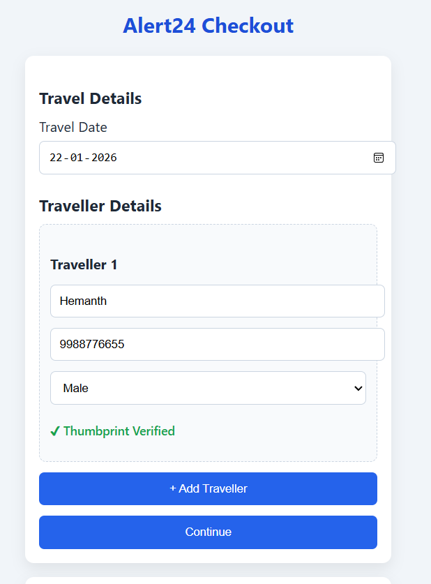
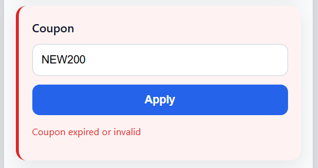
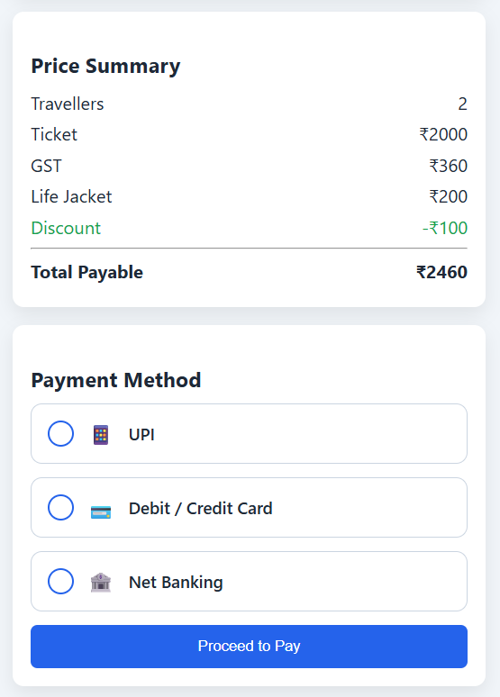
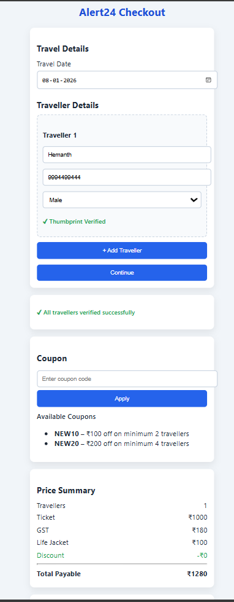

# Alert24 – Responsive Checkout Page

## Project Overview
This project is a responsive checkout page built as part of the Frontend Internship Assignment for **Alert24 Safety Systems**.

The application allows a user to:
* Enter customer details
* Select number of travellers
* Choose a travel date
* Apply a coupon code
* View final price calculation

The focus of this project is clear logic, clean UI, and correct pricing, not perfection.

---

## Tech Stack
* **React** (Vite)
* **JavaScript**
* **HTML**
* **CSS**

---

## How to Run the Project

1.  **Install Node.js**
2.  **Clone the repository**
    ```bash
    https://github.com/KHReddy7416/alert24-checkout.git
    ```
3.  **Open the project folder**
    ```bash
    cd alert23-checkout
    ```
4.  **Run the following commands:**
    ```bash
    npm install
    npm run dev
    ```
5.  **Open the browser and go to:**
    `http://localhost:5173`

---

## Features Implemented

### Traveller Details
* Customer Name input
* Contact Number input
* Travel Date picker
    * Past dates are disabled
    * Date selection is mandatory
* **Number of Travellers**
    * Minimum 1 traveller
    * Can increase/decrease using + / −
    * Can directly type large numbers (e.g. 50, 100)
* **Simulated Thumbprint Capture**
    * Implemented as a confirmation button
    * No real biometric data is collected



---

### Pricing Logic
* **Ticket cost:** ₹1000 per traveller
* **Life jacket cost:** ₹100 per traveller
* **GST:** 18% applied only on ticket price
* All calculations are updated dynamically when traveller count changes

---

### Coupon Logic
The following coupon codes are supported:
* **NEW10**
    * Minimum 2 travellers
    * ₹100 discount
* **NEW20**
    * Minimum 4 travellers
    * ₹200 discount

**Coupon behavior:**
* Valid coupon → success message (“Hurray”)
### Coupon Applied (Valid)


* Invalid or expired coupon → error message
### Coupon Invalid / Expired


* Price summary is shown after coupon interaction

---

### Price Summary
The price summary displays:
* Number of travellers
* Ticket total
* GST amount
* Life jacket cost
* Discount
* Final payable amount

The summary is designed to clearly highlight the final payable amount.


---

### UI & Responsiveness
* Mobile-first design
* Single-column layout
* Clean and simple UI
* Desktop view shows a centered mobile-style layout
* No UI libraries used (plain CSS)

---

## Assumptions Made
* Traveller count represents the number of tickets booked by one customer
* Individual traveller names/details are not collected, as they were not required
* Thumbprint capture is simulated using a button, since real biometric capture is not possible in a frontend-only application
* Pricing logic is handled completely on the client side

---

## Limitations / Notes
* No backend integration
* No payment gateway integration
* No real biometric or identity data is collected

---

## Conclusion
This project focuses on:
* Clear understanding of requirements
* Correct pricing logic
* Simple and usable UI

The implementation follows the assignment guidelines closely and is kept intentionally simple and readable.

### Final Output (Mobile View)
